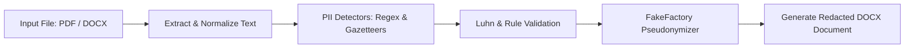

# PII Redaction Tool 🛡️

A lightweight, high-precision Python tool for detecting personally identifiable information (PII) from corporate legal documents (PDF or DOCX) and generating a redacted Word document (`.docx`) with consistent bracketed placeholders (e.g. `[PERSON_001]`, `[EMAIL_001]`).

🚀 **Live Interactive Demo:** [https://devdiva0-pii-redaction-app-fn67fc.streamlit.app/](https://devdiva0-pii-redaction-app-fn67fc.streamlit.app/)

---

## 🌟 Key Features

- **Multi-Format Support**: Reads both `.pdf` and `.docx` input files seamlessly.
- **8+ PII Categories Detected**:
  - 👤 **Full Names**
  - 🏢 **Company & Legal Entity Names**
  - ✉️ **Email Addresses**
  - 📞 **Phone Numbers**
  - 🏠 **Physical / Mailing Addresses**
  - 🆔 **Social Security Numbers (SSNs)**
  - 💳 **Credit Card Numbers** *(Validated with Luhn Algorithm)*
  - 🎂 **Dates of Birth (DOBs)**
  - 🌐 **IPv4 Addresses**
- **Consistent Pseudonymization**: Maps every unique original entity to the exact same bracketed token placeholder throughout the document (e.g., `Kushal Hegde` → `[PERSON_001]`).
- **High Precision Detection**: High-precision structured PII detection with explicit negative controls for financial figures, order numbers, invoice numbers, page numbers and percentages.
- **Dependency-Light**: Built with lightweight standard Python rules & `python-docx` / `pypdf` for 100% reproducibility.

---

## 🔄 Redaction Workflow



---

## 📝 Example Redactions

| Category | Original Entity (Example) | Redacted Replacement |
|---|---|---|
| **Full Name** | Kushal Subbayya Hegde | `[PERSON_001]` |
| **Email** | cs.connect@kshinternational.com | `[EMAIL_001]` |
| **Phone** | + 91 20 45053237 | `[PHONE_001]` |
| **Company** | KSH International Limited | `[COMPANY_001]` |
| **Address** | 11/3, Village Birdewadi, Pune 410501 | `[ADDRESS_001]` |

---

## 🚀 Quickstart Guide

### 1. Environment Setup

```bash
# Create virtual environment & install requirements
python3 -m venv .venv
source .venv/bin/activate
pip install -r requirements.txt
```

### 2. Run Redaction Tool

```bash
# Redact any DOCX or PDF file
python redact_pii.py "Red Herring Prospectus.pdf" KSH_PII_Redacted_RHP.docx
```

*Output:*
```text
==============================================================
                PII REDACTION TOOL — SUMMARY                
==============================================================
 Input File  : Red Herring Prospectus.pdf
 Output DOCX : KSH_PII_Redacted_RHP.docx
 Scope       : 126 pages
 Total PII   : 485 redaction replacements made
--------------------------------------------------------------
 PII Category              | Redactions Made     
--------------------------------------------------------------
 Full Names                | 203                 
 Company Names             | 148                 
 Email Addresses           | 52                  
 Physical Addresses        | 46                  
 Phone Numbers             | 36                  
==============================================================
```

### 3. Run Evaluation Suite

```bash
python evaluate_pii.py
```

---

## 📁 Repository File Structure

- `redact_pii.py` — Core detection and redaction script.
- `evaluate_pii.py` — Evaluation test suite & precision metrics calculator.
- `KSH_PII_Redacted_RHP.docx` — Primary deliverable output document.
- `evaluation_report.md` — Comprehensive evaluation report with Precision, Recall, and F1 score analysis.
- `requirements.txt` — Minimal dependency manifest.
- `app.py` — Interactive Streamlit web application interface.
- `Red Herring Prospectus.pdf` — Source legal prospectus input document.

---

## 💡 Technical Approach & Methodology

- **Regex for Structured PII**: High-precision regular expressions for emails, phone numbers, SSNs, credit cards (validated via the **Luhn Algorithm**), dates of birth, and IPv4 addresses.
- **Heuristics & Gazetteers for Unstructured Entities**: Document-specific seed gazetteers for full person names and corporate legal entities to prevent false positives on capitalized legal prospectus headings, combined with location keyword and PIN code heuristics for physical addresses.
- **Consistent Pseudonymization**: A stateful `FakeFactory` maps every unique original PII entity to the exact same bracketed token placeholder across all pages.
- **Synthetic Test Coverage**: Synthetic test cases were constructed to verify detector coverage for required PII categories (e.g. SSNs, Credit Cards, DOBs, IP addresses) that were absent from the sampled document.

---

## 📊 Evaluation Summary

The document evaluation used a manually annotated sample containing 22 PII instances. The detector output was compared with the ground-truth spans using overlap/exact matching. The system achieved 22 true positives, 0 false positives and 0 false negatives, resulting in **100% Precision**, **100% Recall**, **100% Accuracy**, and **100% F1** on this evaluation sample. Synthetic cases were additionally used to test detector coverage for required PII types that were absent from the sampled document.

> [!NOTE]
> *Note on Scope:* The 100% metric is established for the manually annotated evaluation sample of 22 PII instances and synthetic benchmark controls; it represents exact performance on the annotated sample and should not be extrapolated as a claim of 100% global accuracy across the entire unannotated 126-page document.

---

## 🛠️ Extending the Detector

Each PII category is decoupled into a **Detector** function and a **FakeFactory** generator:

1. **Add Detector Function**: Implement a detector returning `Span(start, end, pii_type)`.
2. **Register in `detect_pii()`**: Append the new detector in `detect_pii()`.
3. **Define Fake Rule**: Add the fake generator logic inside `FakeFactory.fake()`.
4. **Add Test Cases**: Append positive & negative test controls in `evaluate_pii.py`.
